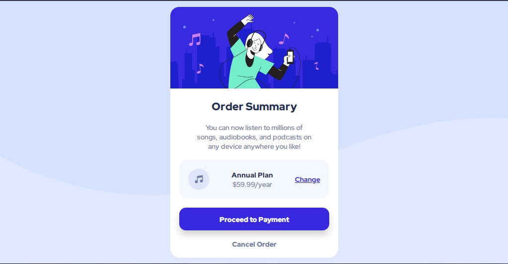

# Frontend Mentor - Order summary card solution

This is a solution to the [Order summary card challenge on Frontend Mentor](https://www.frontendmentor.io/challenges/order-summary-component-QlPmajDUj). Frontend Mentor challenges help you improve your coding skills by building realistic projects. 

## Table of contents

- [Overview](#overview)
  - [The challenge](#the-challenge)
  - [Screenshot](#screenshot)
  - [Links](#links)
- [My process](#my-process)
  - [Built with](#built-with)
  - [What I learned](#what-i-learned)
  - [Continued development](#continued-development)
- [Author](#author)

## Overview

### The challenge

Users should be able to:

- See hover states for interactive elements

### Screenshot

### Links

- [Solution URL](https://your-solution-url.com)
- [Add Live Site](https://6xg0d.github.io/order-summary-component/)

## My process

After been practicing with a few other challenges, this one was pretty easy and fun to do! I'm proud that i did it in a short amount of time compared to the other ones, and just spend the rest trying to reduce and optimize the css file.

### Built with

- Semantic HTML5 markup
- CSS
- Flexbox
- Mobile-first workflow

### What I learned

This challenge helped me to practicing the fundamentals, my semantic HTML, and a lot more. Gaining confidence after solve a challenge even when it's easy always boosts up the mood! :) 

### Continued development

I'd like to change the responsive to change the image to the side, instead of just the background. Similar to the "product-preview-card-component" just to practice even more the responsive design.

## Author

- Frontend Mentor - [@6xg0d](https://www.frontendmentor.io/profile/6xg0d)